# Wild Apricot Text Manager

## Project Description
The [Wild Apricot Text Manager](https://www.newpathconsulting.com/watm) (aka WATM) is a simple to configure JavaScript library that levers the jQuery library already included with every [Wild Apricot](https://wildapricot.com) website. WATM will help any administrator manage and replace nearly every piece of system text in Wild Apricot. You can also use it to change CSS for any class or ID. WATM can be used optionally to enable 2 language Wild Apricot websites without needing to create any additional site pages or page templates. A list of replaceable elements is included in the easy-to-edit Excel configuration file. You can make a variety of changes such as global search and replace, modifying form labels and buttons, changing CSS properties on any class or ID and hiding certain labels or buttons altogether.

The configuration for the Wild Apricot Text manager is made inside a comma separated configuration file which can be edited in Microsoft Excel or another text editor. 

## Change History
0.1 - Initial Release 11/19/18

0.2 - Added support for many more system flags, added French translation into CSV configuration file, changed testing button toggle label 11/27/18

0.3 - Added support for adding a style, added several more system labels, added support for limiting the language toggle display "flicker" 12/5/18

0.4 - Added support for effective primary menu design changes, added support to override any CSS class or ID 12/13/18

0.5 - Added support for mouseover, mouseout (hover) and :before and :after pseudo-elements 1/15/19

0.6 - Added support for SCSS-style variables 1/24/19

0.7 - Now managed in GitHub, fixed issues related to Internet Explorer 11 support in the CSV parser and in the WATM library 2/23/19

## Installation

### Script Setup
1.	In Admin View of Web Apricot, browse to Settings -> Site -> Global JavaScript. More details on inserting JavaScript into Wild Apricot are available in [Wild Apricot Documentation](https://gethelp.wildapricot.com/en/articles/212-inserting-and-modifying-html-or-javascript#javascript).
2.	Copy and paste the following lines to the Global JavaScript.
```javascript
<!-- jQuery-CSV Source: https://github.com/evanplaice/jquery-csv -->
<script src="/resources/Theme/WildApricotTextManager/jquery.csv-0.8.9-mod.js"></script>
<script src="/resources/Theme/WildApricotTextManager/wildapricot-textmanager.js"></script>
<script>
  var textManagerProductionMode = false;
  var textManagerMultilingualMode = true;
  var primaryLanguageButtonName = "English";
  var alterativeLanguageButtonName = "Français";
  var languageButtonHtmlID = "languageButton";
  var alterativeLanguageClassName = ".french";
  var primaryLanguageClassName = ".english";
  
  $(window).bind("load", function() {$('#textmanager_overlay').css('display', 'none'); });  // Fail-safe to remove white overlay
</script>
```

**Note:** If you want to use the "automatic update" feature for WATM, you can load the JavaScript libraries from a  free, publicly available content delivery network (CDN). This will enable WATM to be updated automatically if there is a change or useful feature added, but it also has the risk of potentially breaking WATM on your site. The risk is not high, but it *is* possible. If you load the libraries into your Wild Apricot site rather than load it off a CDN you will **not** receive any automatic updates.

To enable automatic updates use the following Global JavaScript:

```javascript
<!-- jQuery-CSV Source: https://github.com/evanplaice/jquery-csv -->
<script src="https://cdn.jsdelivr.net/gh/asirota/watm/WildApricotTextManager/jquery.csv-0.8.9-mod.js"></script>
<script src="https://cdn.jsdelivr.net/gh/asirota/watm/WildApricotTextManager/wildapricot-textmanager.js"></script>
<script>
  var textManagerProductionMode = false;
  var textManagerMultilingualMode = true;
  var primaryLanguageButtonName = "English";
  var alterativeLanguageButtonName = "Français";
  var languageButtonHtmlID = "languageButton";
  var alterativeLanguageClassName = ".french";
  var primaryLanguageClassName = ".english";
  
  $(window).bind("load", function() {$('#textmanager_overlay').css('display', 'none'); });  // Fail-safe to remove white overlay
</script>
```

### Files Setup
1.	In Admin view of Wild Apricot, browse to [Website -> Files](https://gethelp.wildapricot.com/en/articles/177#uploading). 
2.	Create a new folder named `WildApricotTextManager` under the Theme folder.
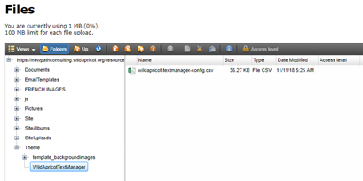
3.	Upload jquery.csv-0.8.9-mod.js to the new folder.
4.	Upload wildapricot-textmanager.js to the new folder.
5.	Upload wildapricot-textmanager-config.csv to the new folder. 


### Overlay Setup (Optional)
Normally, when the text manager is enabled, the original text is displayed on the page load and then replaced within one second. This "flicker" can be hidden with the HTML and CSS below. The WATM will automatically remove the overlay once the script has been completed, reducing the flicker.

Open the each Wild Apricot Page Template in use, add a [Custom HTML](https://gethelp.wildapricot.com/en/articles/408) gadget anywhere in the template. Edit the code of the Custom HTML gadget and include this HTML snippet:
```html
<div id="textmanager_overlay"></div>
```

You must also ddd these lines to the Wild Apricot global CSS in the [Website -> CSS](https://gethelp.wildapricot.com/en/articles/438#entering) menu:
```css
#textmanager_overlay {
    position: fixed;
    width: 100%;
    height: 100%;
    top: 0;
    left: 0;
    right: 0;
    bottom: 0;
    background-color: white;
    z-index: 2;
}
```

### Multilingual Setup (Optional)
To move the Language button from the default location:
1.	In Admin View, browse to each page template in use.
2.	Click Edit, then Gadgets, then drag and drop Custom HTML gadget to where you would like to place the button.
3.	Click Edit code and delete the default “Insert your HTML code here”. 
4.	Click Settings button for the new gadget. On the left panel, show Advanced and then replace the HTML ID with `languageButton` then Save the template.
5.  Repeat this for each page template.
5.	(Optional) Customize the look of the button by applying custom CSS class to the `#languageButton ID` in the WATM configuration file.

### Add the translated content
The below is an example of adding translated content to a Wild Apricot "Contact" page.

1.	Start with your Contact page. In Admin Mode, browse to Website -> Site pages -> Contact and click Edit. You may have a different page on your site, and you can start with any page.
2.	Click on Gadgets and drag a new Content gadget below the existing Contact us heading. If your second language is French, then type in `Contactez nous` into this new space. Adjust font sizes and padding to match the original content.
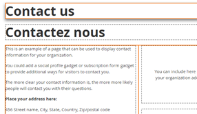
3.	Show [Advanced settings section](https://gethelp.wildapricot.com/en/articles/187#settings) on the left settings panel and add `french` to the CSS class text box.
4.	Click on the original English Contact us heading and add `english` to the CSS class text box.
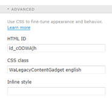
5.	Repeat for other content blocks you wish to localize and Save page. The result should look similar to below:
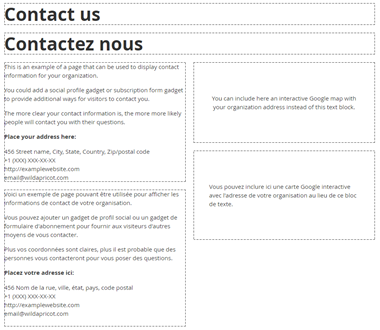


Note that if WATM is enabled, one of the two languages will be hidden based on the state of the language, even in the Admin Edit mode. Please make sure textManagerProductionMode = false is set in JavaScript configuration and then click the button to disable WATM to see both sets of languages at once.
 
## Wild Apricot Text Manager Configuration File
Opening the configuration file in Excel or another commas seperated file (CSV) editor.
 1. Choose Delimited, check My data has headers and click Next
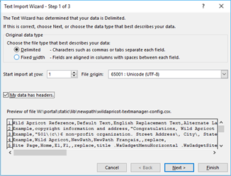  
 2.   Check Comma for the Delimiters option, Click Finish
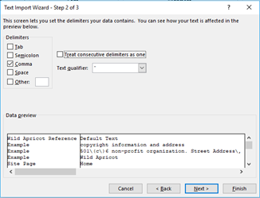  

Saving the configuration file
When saving the file, use the CSV UTF-8 (Comma delimited) (*.csv). Other formats will break WATM!

### Columns in the WATM Configuration File

####Note: Inserting or moving columns will break WATM!

**Wild Apricot Reference**: Name of the Wild Apricot System Gadget. For administrative use only.

**Default Text**: The text displayed in the default Wild Apricot gadget or label. 

**English Replacement Text**: If text is placed in this column, a replacement is done. Blank rows are ignored. Optional.

**Alternative Language Text**: Optional.

**Notes**: Any other helpful notes can be added here for reference.

### Function: 
*	**text** – sets text of the element selected by the Query column.
*	**hide** – hides the element selected by the Query column.
*	**button** – sets value of the button selected by the Query column.
*	**placeholder** – sets placeholder attribute. Only used for search boxes.
*	**delay** – page will pause one second before replacing text. Used on elements that are written with JavaScript after page load.
*	**replace** – Searches for Default Text column and replaces this sub-string in any element. If Query column is blank, the entire page is searched. 
*	**replace_element** – Searches Default Text and replaces the text of the entire element. If Query column is blank, the entire page is searched.
*	**replace_delay** – Replaces sub-string after one second delay.
*	**inactive** – disables current configuration row. Can be used to save a configuration, but not use it.

**Note:** You can leave function empty to apply CSS to any CSS class or ID set in the **Query** column.

#### CSS-only functions:
*	**mouseover** – Sets CSS inside an event handler when hovering over an element.
*	**mouseout** – Sets CSS inside an event handler when no longer hovering over element.

**Query**: jQuery syntax for selecting an element. 

**Style**: Set the CSS style for the element. Optional.
 
## Example:
### Change the label “Current status” on Membership Renewal system gadget:

Here is what the standard Membership Renewal system gadget looks like:

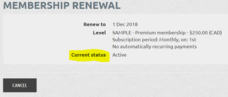  

- [ ]	Open wildapricot-textmanager-config.csv in your text editor or Excel.

- [ ]	Search the file for “Current status”. Verify **Wild Apricot Reference** column matches the name of the gadget we’re looking at.

- [ ] Type in new text `My New Text!` in **English Replacement Text** column.

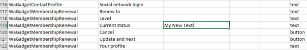  

- [ ] (Optional) Type translated language text in **Alternative Language Text**. 

- [ ] Save as `CSV UTF-8 (Comma delimited) (*.csv)`

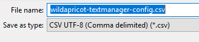  

- [ ] Upload/Update .csv file

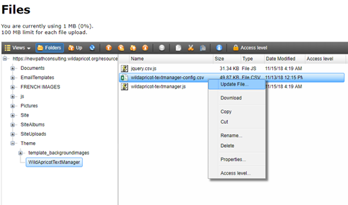

- [ ] Load the membership renewal page and use the toggle buttons to test.  

Here is what the new Membership Renewal system gadget should look like:

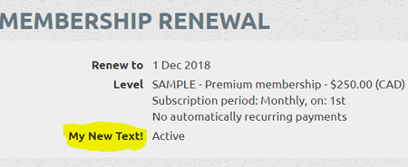  

## System Requirements

WATM must be used with a free or paid Wild Apricot account. WATM is supported on the latest versions of Chrome, Safari, Firefox and Edge. Older browsers like Internet Explorer on Windows are supported "best effort," without formal testing or 100% compatibility.

## Further Examples

### Hide an element:
```
Default Text: Type the 6 characters you see in the picture
Function: hide
Query: .captchaGuiding
```
### Replace title of page on all menus:	
```
Default Text: Directory
English Replacement Text: Members Directory
Function: replace
Query: title .WaGadgetMenuHorizontal .WaGadgetMenuVertical .WaGadgetSiteMap
 .WaGadgetNavigationLinks .WaGadgetBreadcrumbs
```
### Replace title of page on only main menu:	
```
Default Text: Directory
English Replacement Text: Members Directory
Function: replace
Query: .WaGadgetMenuHorizontal 
```
### Replace text of any element of any page:
```
Default Text: 501\(c\)6 non-profit organization
English Replacement Text: My Organization Name
Function: replace_element
(Note: Use backslash to escape special characters such as commas, parentheses, brackets.)
```
### Set CSS of an element:
```
Query: h2
Style: { "color" : "red", "font-style" : " italic" }	
```
### Set CSS of :before or :after (Note the use of standard CSS formatting):
```  
Query: .WaGadgetCustomMenu.menuStyleNone .orientationVertical li:before
Style: { content: "|"; color: #5e5e5e }
```
### Set CSS :hover of a button (Note, :hover is not needed in Query):
```
Query: .functionalButton
Style: { "color": “white", " background": "#a80532" }
```