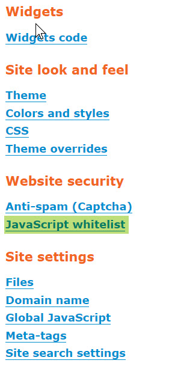
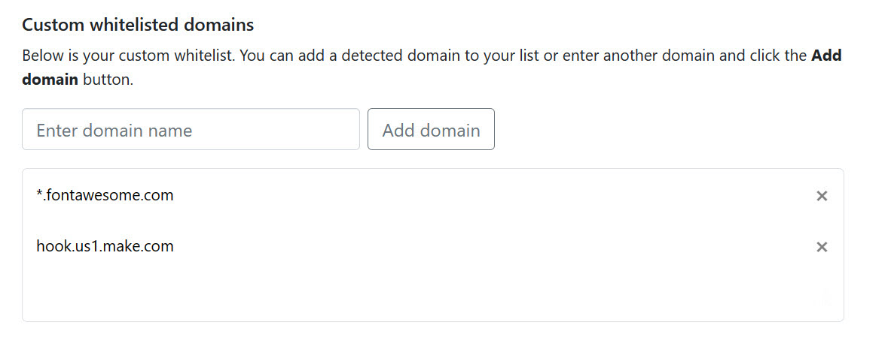

# Documentation

## Project Description

[EZ WildApricot Web Designer 2](https://newpathconsulting.com/watm) \(aka WATM\), has been redesigned from scratch. The product has been rewritten in JavaScript (ECMAScript 6) and no longer needs jQuery to operate. 

EZ WildApricot Web Designer will help any administrator change, replace or translate e nearly every piece of hard-coded and configurable text in WildApricot. It also contains several "macros" that can add new content gadgets and content styling features for your WildApricot website.

You can make a variety of single page, whole site, and WildApricot content changes such as:

- search and replace of a particular text string
- modify field labels on forms, button labels
- change hard-coded text, errors, and warnings
- hide text on any user interface items
- allow your site to be offered in an unlimited number of languages

EZ WildApricot Web Designer module can be used to make WildApricot sites available in two or more languages by dynamically replacing strings with a translated string. A translator will use a comma separated value (CSV) configuration file that is easily editable, making it easy to maintain hundreds of modifications in a human-readable file.

---
# Installation

## Files Setup

1. Follow these [instructions to connect to your WildApricot file folder](https://gethelp.wildapricot.com/en/articles/198-uploading-and-downloading-files-using-webdav) or go to the Website -> Files manager.
2. Unzip the downloaded zip file and upload the folder `WildApricotTextManager`into /Theme/WildApricotTextManager.
3. If you are setting up a multilingual site:
  * Add a Content Gadget to your page template in the location you would like the language toggle to appear. Set the ID of this gadget to `language_switch`
  * Create a separate CSV for each language you need in the `translations` folder.

The configuration and translation files must be saved as a CSV file format in UTF-8 format.

## Domain whitelisting

WildApricot has implemented a [Content Security Policy (CSP)](https://en.wikipedia.org/wiki/Content_Security_Policy) to provide additional protection against data theft, site defacement, malware, and more. CSP works by detecting if custom code is being called from an external URL and then comparing those URLs against a whitelist of verified and approved websites. If the external URL being used is not on the whitelist, the code is then blocked from running. EZ WildApricot Web Designer requires access to certain external URLs in order to function correctly, so these URLs will need to be added to the whitelist. To view and manage your whitelist, navigate to the "Settings" screen from the Website section of the WildApricot backend.




**Adding EZ WildApricot Web Designer URLs to Custom Whitelisted Domains**

Under the section "Custom whitelisted domains", you must add manually URLs used by EZ WildApricot Webs Designer. This is what the custom domain whitelist will look like once you add all core and add-on required domains.




The following is a list of all the external URLs currently being implemented by EZ WildApricot Web Designer and can be added manually:

**Core Plugin**
* unpkg.com
* hook.us1.make.com

**EZ Add-Ons**
* *.fontawesome.com

## Script Setup

1. In WildApricot Admin, navigate to Settings -&gt; Site -&gt; Global JavaScript. More details on inserting JavaScript into WildApricot are available in the [WildApricot Documentation](https://gethelp.wildapricot.com/en/articles/212-inserting-and-modifying-html-or-javascript#javascript).
2. Copy and paste the following lines to the Global JavaScript.

NOTE: this code snippet assumes you have uploaded all files into the folder `/resources/Theme/WildApricotTextManager`

   ```html
  <script src="/resources/Theme/WildApricotTextManager/wildapricot-textmanager.js"></script>
  <script>

    // Enter your license key if you have one - omit to use a trial that uses the first 10 lines of a config file
    license_key = "";

    /*
      Array of available languages
      Can omit if site is not multilingual
      Use "watm_language_name" to assign the language name displayed to the user
      Use "watm_language_className" to assign the language slug used on your site
    */
    watm_language_name[0] = "English";        // Default language
    watm_language_className[0] = "english";   // watm_language_csv_file[0] will default to english.csv
    watm_language_name[1] = "Français";
    watm_language_className[1] = "french";    // watm_language_csv_file[1] will default to french.csv
    watm_language_name[2] = "Español";
    watm_language_className[2] = "spanish";   // watm_language_csv_file[2] will default to spanish.csv
    watm_language_name[3] = "日本語";
    watm_language_className[3] = "japanese";  // watm_language_csv_file[3] will default to japanese.csv

  </script>
   ```
   
   3. Enter your license key in the quotes `""` to apply your license.
   
## Extra Install Script Options

### Enablic the Inspector & Editor without Being Logged in as an Admin
By default, the Inspector & Editor can be used only when logged in as an administrator to the Wild Apricot Admin view. If you'd like to be able to view the Inspector & Editor without being logged in to the Admin view, add this line in the install script
 
`enable_public_editor = true;`

To save any changes you make while in this mode, you will need to provide an administrative username/password during the first save.

### Installing EZ Add-ons

To install an EZ add-on, place the add-on file into the `ez-addons` folder. Next, add the following code to your JavaScript configuration:

`ez_addons = [];`

Within the square brackets, add type the name of the add-ons within quotes. Separate multiple add-ons with a comma, with each add-on name within their own quotation marks.


---
# Switching Languages

## Using the Language Toggle

EZ WildApricot Web Designer provides an easy to install toggle for switching between the various languages on your site. To add it to your site, simply  add a Content Gadget to your page template in the location you would like the toggle to appear. Set the ID of this gadget to `language_switch`. This gadget will now be replaced with the language toggle when viewed from the frontend.

## Using the Language Switch Hook

You are not limited to using the EZ WildApricot Web Designer Language Toggle. You can create your own buttons, links, or menu items for switching the language. To switch language, you would link to `?watm-<language>` where `<language>` is the class name for the language you wish to use from the script setup. Note, there is no slash in this link - you are linking to the current page, and appending the language hook to it.

**EXAMPLE:**

```html
<a href="?watm-french">Cette page est également disponible en français</a>
```

---

# EZ WildApricot Inspector & Editor

Using the Inspector & Editor, you can use to view the styling and targeting information of the various elements on your website, as well as make modifications to your EZ WildApricot Web Designer configuration files. This information is necessary when updating your configuration and translation files.

 When logged in as a WildApricot administrator, an icon will appear at the bottom-left of your screen. Click on the icon to launch the inspector and editor. While in Editor mode, you will not be able to follow any links on the web page. Click the Exit Editor button in the inspector to return to normal browsing. When you hover over an element a red outline will appear around the element. You can right click on the icon to move the icon to the left or right side for the screen.

# Inspector

The top half of the panel that appears is the Inspector. Clicking on the element will display the element's CSS Class (if a class has been set), as well as the CSS path to the element.

The `Copy Element Class`, and `Copy CSS Path` buttons will copy the related information to the clipboard. You can use either one for the Query part of the configuration. CSS Path is always more specific and usually the best Query to use. The CSS Element Class can have unintended consequences on other elements that share the same CSS Class, but sometimes using a CSS Class is a good fallback if the CSS Path is not working to change the site.

*COMPATIBILITY NOTE:* The Copy Element Class and Copy CSS Path buttons only work on secure (https) websites. If your website is running insecurely, we recommend adding a [free SSL certificate to your custom domain](https://gethelp.wildapricot.com/en/articles/555).

The `View Properties` button will display the details about that element, such as the text it contains, styling, and any resource links.

---

# Editor

The bottom half of the panel displays the configuration file Editor. In the editor you can select the file you wish to update from the dropdown. Selecting the file will automatically load the configuration file editor. You can resize the columns as needed by dragging on the divider on the right hand side of the panel. You can also drag the rows to rearrange them. Right clicking on a row will give you the options to create and delete rows, and download the currently saved configuration file

Once you are finished making your changes, save the file back to your website by clicking on `Save changes to site`. You will need to authenticate once with your administrative WildApricot account.

If you choose to download the configuration file and edit it outside of the Inspector, the changes will be applied only when you manually upload the configuration file. The configuration file is a comma-separated file that can be edited in any spreadsheet. If you decide to edit in a spreadsheet, ensure you save in UTF-8 format to preserve any international characters.

When you use the Inspector to save the configuration file, the current page will automatically refresh, and your changes should be immediately visible.  If you don't see your changes, you may need to do a hard refresh of your site to see the changes. To do this, exit the inspector/editor and press <kbd>Ctrl</kbd> + <kbd>Shift</kbd> + <kbd>R</kbd> on PC or <kbd>Option</kbd> + <kbd>Shift</kbd> + <kbd>R</kbd> on Mac. You may need to do this for each language enabled on your site.

---

# EZ WildApricot Web Designer Functions

When editing the EZ WildApricot Web Designer configuration and translation files, the following functions are available: Ech function operates in a specific way to modify, hide or translate parts of your website.


## **text**
> Changes the text in targeted element(s), note that any links are eliminated in the targeted element(s). Note that the Default Text is empty (and ignored if filled) when using the text function.

**EXAMPLE:**
```text
Function: text
Replacement Text: Change my password!
Query: .loginBoxChangePassword
```
## **replace**
> Finds and replaces specific text in targeted element(s). Note that the Default Text must match the text that is being replaced.

**EXAMPLE:**
```text
Default Text: Home
Function: replace
Replacement Text: Accueil
Query: .menuInner, .WaGadgetBreadcrumbs > div > ul > li
```


## **shortdelay**
> Changes the text in targeted element(s) after **n** second - used for dynamically generated elements, such as a member directory. Note that the Default Text must match the text that is being replaced. Default delay time is one second, and you can customize this by adding the following to the JavaScript configuration:

  ```html
short_delay = 1;
```

`shortdelay` function will trigger the `replace` function after a ***n*** second delay if "Default Text" is present (otherwise it triggers `text` function).


**EXAMPLE:**
```text
Replacement Text: Coordonnées
Function: delay
Query: #membersTable > thead > tr > th:nth-child(1)
```

## **longdelay**
> Changes the text in targeted element(s) after **n** second - used for dynamically generated elements, such as a member directory. Note that the Default Text must match the text that is being replaced. Default delay time is three seconds, and you can customize this by adding the following to the JavaScript configuration:

  ```html
long_delay = 3;
```

`longdelay` function will trigger the `replace` function after a ***n*** second delay if "Default Text" is present (otherwise it triggers `text` function).


**EXAMPLE:**
```text
Replacement Text: Coordonnées
Function: delay
Query: #membersTable > thead > tr > th:nth-child(1)
```

## **button**
> Changes the text on targeted button(s)

**EXAMPLE:**
```text
Default Text: Click here to login
Function: button
Query: .loginButton
```
## **delaybutton**
> Changes the text on targeted button(s), after a 1 second delay, useful for widgets that have a JavaScript rendering delay

**EXAMPLE:**
```delaybutton
Default Text: Click here to login
Function: button
Query: .loginButton
```

## **inactive**
> Ignores the configuration row. This is useful when troubleshooting an item or you wish to save details in the configuration file, but not activate it.

## The style column can be used in conjunction with a function, or on it's own.
**EXAMPLE:**
```text
Query: h3
Style: color: blue;font-style: italic
```

## **hide**
> Hides the targeted element(s). This is useful when you wish to hide an element altogether. Neither Default Text or Replacement Text fields are necessary or used.

**EXAMPLE:**
```text
Function: hide
Query: #idFooterPoweredByWA
```

## **placeholder**
> Changes the placeholder text of targeted form element(s)

**EXAMPLE:**
```text
Replacement Text: Enter your search keywords here
Function: placeholder
Query: .searchBoxField
```


## **attribute**
> Sets/changes attribute of targeted element(s). Enter attribute name in "Default Text" column, and the attribute value in "Replacement Text"

**EXAMPLE:**
```text
Default Text: target
Replacement Text: _blank
Function: attribute
Query: #id_Footer1 a
```
## **@media**
> Sets a @media CSS Rule. Enter rule name in "Replacement  Text" column

**EXAMPLE:**
```text
Replacement Text: screen and (max-width: 900px)
Function: @media
Query: #id_Header2
Stye: display: none;
```
## **link**
> Changes the target link of an existing link. Specifically it changes the  `href` URL of targeted element(s). Note that almost always the query must contain the `a` target after the CSS Element Class or CSS Element Path.

**EXAMPLES:**
```text
Replacement Text: /donate
Function: link
Query: .headerDonateBtn a
```

```text
Replacement Text: https://newpathconsulting.com/watm
Function: link
Query: #idFooterPoweredByWA a
```

## **createlink**
> Adds a link to an existing non-linked piece of text

**EXAMPLE:**
```text
Default Text: Some Text String that Needs a Link
Replacement Text: https://newpathconsuling.com
Function: createlink
Query: #someID
```

## **source**
> Changes the `src` URL of targeted element(s). This is useful when changing the iframe src or img src URL to load an alternative image or iframe.

## **tooltip**
> Creates a text popup when mouse is hovered over element

**EXAMPLE:**
```text
Replacement Text: View/Edit Your Profile
Function: tooltip
Query: .loginBoxProfileLink
```

## **googlefont**
> Installs a Google font that can be used throughout other CSS property declarations. Place the font family name to use in the "Replacement Text" field. THe font family name can be obtained from the [Google Fonts](https://fonts.google.com/) website

**EXAMPLE:**
```text
Replacement Text: Lobster
Function: googlefont
```

---
# EZ Add-Ons

EZ WildApricot Web Designer includes a number of add-ons that can be used to extend the capabilities of the WildApricot website module. To install an add-on, place the add-on file into the `ez-addons` folder. Next, add the following code to your JavaScript configuration:

`ez_addons = [];`

Within the square brackets, add type the name of the add-ons within quotes. Separate multiple add-ons with a comma, with each add-on name within their own quotation marks.

## **FontAwesome Add-On**

EZ WildApricot Web Designer comes with a free Add-on for FontAwesome, making it easy to insert FontAwesome icons by using macros. To start, [sign up for FontAwesome](https://fontawesome.com/start) and add the provided JavaScript code snippet to your WildApricot Global JavaScript settings.

Here's an example of the code you may add. Make sure the `YOUR_FONTAWESEOME_KIT_ID` is replaced with the actual ID below.

`<script src="https://kit.fontawesome.com/YOUR_FONTAWESEOME_KIT_ID.js" crossorigin="anonymous"></script>`

To enable the addon, add this line to your EZ WildApricot Web Designer JavaScript installation script:

`ez_addons = ["fontawesome"];`

To insert an icon, first [find the name of the icon you wish to use](https://fontawesome.com/search?o=r&m=free&s=solid). Add

`[ez-fa]icon name[/ez-fa]`

to any WildApricot content or headline gadget.

You can copy the name of icon by clicking on the icon and copying the text above the icon:


**EXAMPLE:**
```text
Macro Text: [ez-fa]home[/[ez-fa]
Result: 🏠
```

By default, the FontAwesome macro uses the "Solid" icon styles. To use any of the other styles, add a "style" parameter to the macro:

```
Macro Text: [ez-fa style="regular"]home[/[ez-fa]
```

These styles are currently available in FontAwesome, and some icon sets require a paid subscription:

* **Regular:** [Free Icons](https://fontawesome.com/search?o=r&m=free&s=regular&f=classic) | [All Icons](https://fontawesome.com/search?o=r&s=regular&f=classic)
* **Solid:** [Free Icons](https://fontawesome.com/search?o=r&m=free&s=solid&f=classic) | [All Icons](https://fontawesome.com/search?o=r&s=solid&f=classic)
* **Light:** [All Icons](https://fontawesome.com/search?o=r&s=light&f=sharp%2Cclassic)
* **Thin:** [All Icons](https://fontawesome.com/search?o=r&s=thin&f=classic)
* **Duotone:** [All Icons](https://fontawesome.com/search?o=r&s=duotone&f=classic)
* **Brands:** [Free Icons](https://fontawesome.com/search?o=r&f=brands)

## **EZ-Notice Add-On**

The EZ-Notice Add-On enables displaying important, colourful messages on your website. Using this macro, any text is be displayed in a colorful box on a WildApricot web page, spanning the width of the layout that contains the macro. It can be used on any WildApricot content page, page template, or system template.


To use the macro, insert your notice text inside the `[ez-notice][/ez-notice]` tags. An optional `color` parameter can decorate the notice. You can use a [color name](https://www.w3schools.com/colors/colors_names.asp) or [HTML color](https://www.w3schools.com/colors/colors_picker.asp) code. EZ-Notice will use your selected color as the text color for the the notice, and automatically set the notice's border and background color to a matching lighter color.

**EXAMPLES:**
```text
Macro Text: [ez-notice]Guild renewal fess are due by January 15th.[/ez-notice]
Macro Text: [ez-notice color="red"]Saturday's potter classes have been cancelled.[/ez-notice]
```

## **EZ-Toggle Add-On**

The EZ-Toggle Add-On enables expandable and collapsible content sections (also known as "accordions"). Website visitors can click on the section header to open that section and automatically close the other sections on the page. This macro can be used to shorten long content such as a Frequently Asked Questions section.


The macro has two required components. The first is the `title` parameter - use this to specify what the section title should be. Next, place the content for that section within the `[ez-toggle][/ez-toggle]` macro tags. Add a new macro for each section you wish to have. Each section is not required to be placed next to each other and can be located anywhere on the page.

**EXAMPLE:**
```text
Macro Text: [ez-toggle title="How do I join?"]Visit Membership to find and purchase the membership that’s right for you.[/ez-toggle]
Macro Text: [ez-toggle title="Who can be a member?"]Anyone with an interest in our industry may join.[/ez-toggle]
Macro Text: [ez-toggle title="What are the benefits for students?"]We have scholarships students can qualify for.[/ez-toggle]
```

## **EZ-Tabs Add-on**

The EZ-Tabs Add-On creates a tabbed content area on a page. Website visitors can click on the tabs to switch between different content sections.


The macro has two required components. The first is the `title` parameter - use this to specify what the label on the tab should be. Next, place the content for that tab within the `[ez-tabs][/ez-tabs]` macro tags. Add a new macro for each tab you wish to include.

**EXAMPLE:**
```text
Macro Text: [ez-tabs title="2022 Scholarship Winners"]Khloe Blanchard, Deacon Chang, Aine Kerr[/ez-tabs]
Macro Text: [ez-tabs title="2021 Scholarship Winners"]Ella-Mai Kramer, Tea Mcfarlane, Kaci Rankin[/ez-tabs]
Macro Text: [ez-tabs title="2020 Scholarship Winners"]Jennie Miranda, Carina Myers, Ruby-May Waters[/ez-tabs]
```

## **EZ-Library Add-On**

The EZ-Library Addon makes it easy to insert a document library into a WildApricot website. The add-on takes care of formatting the presentation of the selected documents, sorting them by title or date, and makes them available for one-click download.


### **USAGE:**

This add-on comes with two macros that must be used together. The first macro is `[ez-library][/ez-library]` used to configure the library. This macro has three mandatory parameters:

* `folder`: the path to the WildApricot file manager folder containing all the files to be included in the library. This path is relative to the standard "Resources" folder, and the path should not include "Resources". If your documents are located in the "Documents" folder, set the path to "documents". For example, if they are located in a subfolder called "Minutes" inside of the documents folder, set this to "documents/minutes".

* `sort`:  specifies how to sort the files. Set this option to "name" to sort by the display name you assign to the documents in ascending order. Set it to "date" to sort by the date you assign to each document in descending order.

* `view`: specifies the layout of the document library. Currently, only one view is available: "list".

* * The "list" view displays the files in a three-column table. The first column contains an image representing the document type, the second column contains the file's display name, and the third column displays the assigned date. Click on the display name to download the file.

The second macro is `[document][/document]` - this is used for each document you wish to include in the library, and must be located within the `[ez-library][/ez-library]` macro. This macro requires two parameters:

* `date`: This is the date you wish to use for this document. The date is used for sorting and is displayed in the library. The date must be formatted as "YYYY-MM-DD".

* `filename`: This is the filename that the file is saved as.

Within the `[document][/document]` macro, enter the display name to use for the document link.

**EXAMPLE:**
```text
Macro Text:

    [ez-library folder="documents/minutes" sort="date" view="list"]
      [document date="2014-11-01" filename="minutes Nov. 1 2014.docx"]November 2014 Minutes[/document]
      [document date="2017-04-11" filename="Minutes 11 4 17.pdf"]November 2017 Minutes[/document]
      [document date="2015-11-07" filename="meeting 7 nov 2015.doc"]November 2015 Minutes[/document]
    [/ez-library] 
```

---
# Browser Requirements
EZ WildApricot Web Designer is supported on the latest versions of Chrome, Safari, Firefox and Edge. Older browsers like Internet Explorer on Windows are supported "best effort," without formal testing or 100% compatibility.

---
# Release History

0.1 - Initial Release 11/19/18

0.2 - Added support for many more system flags, added French translation into CSV configuration file, changed testing button toggle label 11/27/18

0.3 - Added support for adding a style, added several more system labels, added support for limiting the language toggle display "flicker" 12/5/18

0.4 - Added support for effective primary menu design changes, added support to override any CSS class or ID 12/13/18

0.5 - Added support for mouseover, mouseout \(hover\) and :before and :after pseudo-elements 1/15/19

0.6 - Added support for SCSS-style variables 1/24/19

0.7 - Now managed in GitHub, fixed issues related to Internet Explorer 11 support in the CSV parser and in the WATM library 2/23/19

0.71 - The Wild Apricot Text Manger config file is not cached while in testing mode 2/6/20

0.8 - WATM will now automatically enable when it goes into public view in Wild Apricot, new `attribute` function has been added 6/15/20

0.81 - fixed code typo in wildapricot-textmanager.js due to reformatting 6/29/20

0.82 - added display of WATM version on console log 9/8/20

0.9 - added CSS class/id inspector invoked with `?dev` in URL, added more error/information logging, strip leading/trailing space in "function" field of configuration file 11/20/20

0.91 - Fixed replace\_delay function that works for form dropdowns, added "-n" suffix to the `replace-delay` function. For example, `replace-delay-3` will delay for 3 seconds 11/23/20

0.92 - Fixed bug that prevented text containing HTML and links to be changed with replace or replace_element 3/5/2021

0.93 - support for switching languages using embedded WildApricot "widgets" in 3rd party content management system, added a standard French translation file 2/16/22

0.94 - added support for entering/exiting Inspector panel,  copy/paste of element ID, class and CSS path in Inspector panel, more options  added install script 4/19/2022

0.95 - added support for Inspector Hover mode which shows the outlines of each element on a page when using the Inspector 5/11/2022

0.951 - fixed translations to be rendered for multi-page widgets embedded with a primary and second language 5/17/2022

0.952 - fixed bug on Copy ID button in inspector that adds a # to the id on the clipboard 5/25/2022

0.96 - added showing the selected text of an element, ability to provide alternative text or translation and a drop down for the function, added license checking, trial mode 6/4/2022

2.0b1 - new inspector and configuration file editor, a view properties window including image color picker, support for unlimited languages, easy configuration file upload and preview of changes, rewritten in ECMAScript 6 (no more jQuery!) 8/13/2022

2.0.1 - added a new function for adding a Google font (`googlefont`) and adding a link to a piece of text (`createlink`), added support for cookies to work better 9/8/2022

2.0.2 - bug fixes, minimized french.csv file 9/20/2022

2.0.3 - allow moving of WATM icon to the right or left 10/4/2022

2.0.4 - add [ez-fa] macro for adding FontAwesome glyphs into a WildApricot page 10/6/2022

2.0.5 - added "EZ Macro" add-on architecture, and added [ez-tabs], [ez-notice], [ez-toggle], [ez-library] macros 10/13/2022

2.0.6 - added `delaybutton` function and changed the `delay` function to use `replace` when default text is present 12/06/2023

2.0.7 - changed `delay` to `shortdelay` and `longdelay`, the delays are configurable in the documented Javascript variables 01/04/2023

2.0.8 - NO code changes - README.md updated installation instructions (custom domain before script installation) 02/15/2023
